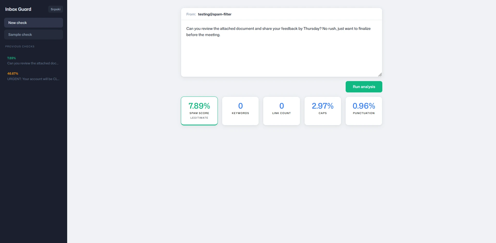
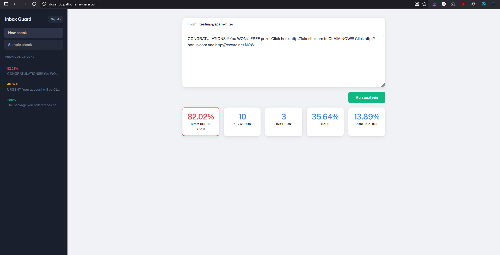

# Fuzzy Guard

**Fuzzy Guard** is a web-based email spam detection system based on **Fuzzy Logic**. Instead of classifying emails strictly as spam or not spam (binary classification), this system calculates the *degree of suspicion* on a scale from 0% to 100% using fuzzy inference.

The application features a responsive web interface with full bilingual support (**English** and **Serbian**).

**Live website:** [dusan86.pythonanywhere.com](https://dusan86.pythonanywhere.com/)

---

## Features

- **Fuzzy Inference System (FIS):** Employs Mamdani fuzzy inference to evaluate multiple email attributes simultaneously.
- **Bilingual Interface:** Real-time translation toggle between English and Serbian.
- **History Tracking:** View and recall previous checks performed during the active session.
- **Sample Loader:** Instantly load random pre-defined test emails to see the system in action.
- **Modern UI:** Sleek dark-mode dashboard styled with CSS.

---

## Screenshots

**Legitimate email - low suspicion score:**



**Spam email - high suspicion score, flagged across all signals:**



---

## How It Works

Traditional spam filters use rigid rules (e.g., "if email contains *FREE* -> spam"). The fuzzy approach maps features to **degrees of membership** in fuzzy sets, combines them using rules through Mamdani inference, and defuzzifies the result using the **centroid method** to produce a final score.

### Input Variables (0-10 or 0-100%)
The system extracts and analyzes four input features from the email text:

| Input | Description | Range |
|---|---|---|
| `kljucne_reci` (Keywords) | Count of identified spam keywords/phrases | 0–10 |
| `broj_linkova` (Links) | Total URL links found in the body | 0–10 |
| `caps_procenat` (Caps % ) | Percentage of uppercase letters in the text | 0–100% |
| `interpunkcija` (Punctuation) | Density of exclamation marks and question marks | 0–100% |

The output `spam_score` (0-100%) is classified into one of three linguistic terms based on the highest membership degree: **LEGITIMATE** (LEGITIMAN), **SUSPICIOUS** (SUMNJIVO), or **SPAM** (SPAM).

---

## Technology Stack

- **Backend:** Python 3 (Flask, `scikit-fuzzy`, `numpy`, `scipy`)
- **Frontend:** HTML5, CSS3, Vanilla JavaScript (bilingual localization, interactive state management)

---

## Project Structure

```text
Fuzzy-Guard/
├── fazi/
│   ├── skupovi.py          # Fuzzy set definitions (trapezoidal and triangular membership functions)
│   ├── pravila.py          # Fuzzy rules and fuzzification of inputs
│   ├── zakljucivanje.py    # Main fuzzy inference controller
│   └── defazifikacija.py   # Centroid defuzzification and category determination
├── veb/
│   ├── static/
│   │   ├── fonts/
│   │   │   └── MonaSansVF[wght,opsz].woff2
│   │   ├── izgled.css      # Styling (Dark mode, responsive grid layout)
│   │   ├── engine.js       # Client-side logic: i18n, fetch calls, history rendering
│   │   └── ikona.svg       # Application logo
│   └── sabloni/
│       └── dashboard.html  # Main GUI markup (forms, history panel, results grid)
├── obrada_teksta/
│   └── analizator.py       # Email text analyzer (feature extraction and sample parsing)
├── screenshots/
│   ├── Legit-example.webp  # Legitimate email example screenshot
│   └── Spam-example.png    # Spam email example screenshot
├── main.py                 # Flask web application entrypoint & REST API routes
├── requirements.txt        # Python package dependencies
├── primeri.txt             # Pre-configured test emails (separated by '---')
├── Procfile                # Deployment configuration (web: python main.py)
└── .gitignore
```

## Fuzzy Sets Configuration

The boundaries for membership functions are configured in `fazi/skupovi.py`:

* **Keywords** `[0–10]`
  - `zanemarljive` (Negligible) — `trapmf [0, 0, 1, 3]`
  - `zastupljene` (Present) — `trimf [1, 4, 7]`
  - `dominantne` (Dominant) — `trapmf [5, 7, 10, 10]`

* **Link Count** `[0–10]`
  - `minimalni` (Minimal) — `trapmf [0, 0, 0, 1]`
  - `umereni` (Moderate) — `trimf [0, 1, 3]`
  - `brojni` (Numerous) — `trapmf [2, 4, 10, 10]`

* **Caps Percentage** `[0–100%]`
  - `uobicajen` (Normal) — `trapmf [0, 0, 1, 10]`
  - `poviseni` (Elevated) — `trimf [7, 18, 35]`
  - `blago_povisen` (Mildly Elevated) — `trimf [10, 35, 65]`
  - `agresivan` (Aggressive) — `trapmf [60, 85, 100, 100]`

* **Punctuation** `[0–100%]`
  - `retka` (Sparse) — `trapmf [0, 0, 2, 5]`
  - `blago` (Mild) — `trimf [3, 15, 30]`
  - `umerena` (Moderate) — `trimf [8, 15, 25]`
  - `agresivna` (Aggressive) — `trapmf [15, 25, 100, 100]`

* **Spam Score (Output)** `[0–100]`
  - `score_legitiman` (Legitimate) — `trapmf [0, 0, 8, 20]`
  - `score_legitiman_energicno` (Energetically Legitimate) — `trimf [10, 15, 20]`
  - `score_sumnjiv` (Suspicious) — `trimf [20, 40, 65]`
  - `score_spam` (Spam) — `trapmf [55, 75, 100, 100]`

---

## Fuzzy Rules

The rules mapping fuzzy inputs to decisions are set up in `fazi/pravila.py`:

| Rule | Condition | Consequent |
|---|---|---|
| **p01** | `zanemarljive` (negligible) AND `minimalni` (minimal) AND `uobicajen` (normal) AND `retka` (sparse) | **LEGITIMATE** |
| **p02** | `blago` (mildly elevated) caps AND `zanemarljive` (negligible) AND `minimalni` (minimal) links | **LEGITIMATE** |
| **p03** | `blago` (mild) punctuation AND `zanemarljive` (negligible) AND `minimalni` (minimal) links | **LEGITIMATE** |
| **p04** | `zastupljene` (present) AND `umereni` (moderate) AND `poviseni` (elevated) AND `umerena` (moderate) | **SUSPICIOUS** |
| **p05** | `zastupljene` (present) AND `minimalni` (minimal) links | **SUSPICIOUS** |
| **p06** | (`zanemarljive` (negligible) OR `zastupljene` (present)) AND `umereni` (moderate) AND `uobicajen` (normal) AND `retka` (sparse) | **SUSPICIOUS** |
| **p07** | `dominantne` (dominant) AND `uobicajen` (normal) caps | **SUSPICIOUS** |
| **p08** | `agresivan` (aggressive) caps AND `zanemarljive` (negligible) AND `minimalni` (minimal) links | **SUSPICIOUS** |
| **p09** | `agresivna` (aggressive) punctuation AND `zanemarljive` (negligible) AND `minimalni` (minimal) links | **SUSPICIOUS** |
| **p10** | (`umereni` (moderate) OR `brojni` (numerous)) links AND (`poviseni` (elevated) OR `blago_povisen` (mildly elevated)) caps AND `zanemarljive` (negligible) keywords | **SUSPICIOUS** |
| **p11** | (`umereni` (moderate) OR `brojni` (numerous)) links AND (`umerena` (moderate) OR `blago` (mild)) punctuation AND `zanemarljive` (negligible) keywords | **SUSPICIOUS** |
| **p12** | `dominantne` (dominant) keywords OR `brojni` (numerous) links | **SPAM** |
| **p13** | `zastupljene` (present) AND (`agresivan` (aggressive) caps OR `agresivna` (aggressive) punctuation) | **SPAM** |
| **p14** | `umereni` (moderate) links AND (`agresivan` (aggressive) caps OR `agresivna` (aggressive) punctuation) | **SPAM** |
| **p15** | `dominantne` (dominant) keywords | **SPAM** |
| **p16** | (`zastupljene` (present) OR `dominantne` (dominant) keywords) AND (`umereni` (moderate) OR `brojni` (numerous) links) AND (`poviseni` (elevated) OR `agresivan` (aggressive) caps) | **SPAM** |

## Installation & Running Locally

1. **Clone the repository:**
   ```bash
   git clone https://github.com/DusanSl/Fuzzy-Guard
   cd Fuzzy-Guard
   ```

2. **Set up a virtual environment (optional but recommended):**
   ```bash
   python -m venv .venv
   # On Windows:
   .venv\Scripts\activate
   # On macOS/Linux:
   source .venv/bin/activate
   ```

3. **Install dependencies:**
   ```bash
   pip install -r requirements.txt
   ```

4. **Run the Flask application:**
   ```bash
   python main.py
   ```
   The application will run locally at `http://127.0.0.1:5000`.

---

## API Documentation

### `POST /analiziraj`

Analyzes an email's body text and returns the computed fuzzy attributes and classifications.

**Request Body (JSON):**
```json
{
  "tekst": "CONGRATULATIONS! You WON a FREE prize! Click http://fakesite.com NOW!" // Text
}
```

**Response (JSON):**
```json
{
  "tekst": "CONGRATULATIONS! You WON a FREE prize! Click http://fakesite.com NOW!", // Text
  "kljucne_reci": 7,       // Keywords
  "broj_linkova": 1,       // Link count
  "caps_procenat": 50.00,  // Caps percentage
  "interpunkcija": 7.14,   // Punctuation
  "spam_score": 82.02,     // Spam score
  "kategorija": "SPAM"     // Category
}
```

### `GET /primer`

Returns a random pre-configured email string from `primeri.txt`.

**Response (JSON):**
```json
{
  "tekst": "Hi, just wanted to confirm our meeting tomorrow at 3pm..." // Text
}
```

---

## License

[](http://creativecommons.org/licenses/by-nc-sa/4.0/)

This work is licensed under a [Creative Commons Attribution-NonCommercial-ShareAlike 4.0 International License](http://creativecommons.org/licenses/by-nc-sa/4.0/).

Full license: [LICENSE](LICENSE.txt) | [CC BY-NC-SA 4.0](https://creativecommons.org/licenses/by-nc-sa/4.0/)

**What this means:**

- **Share** - You can view and fork this repository
- **Adapt** - You can modify the code for educational purposes
- **Attribution** - You must give appropriate credit and link to this repository
- **NonCommercial** - You may not use this work for commercial purposes without permission
- **ShareAlike** - Modified versions must use the same license

**Copyright © 2026 Dušan Slankamenac**

For commercial licensing inquiries: dusanslankamenac8@gmail.com